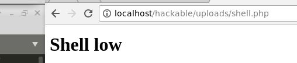
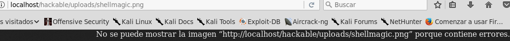

# File Upload

Los archivos cargados representan un riesgo significativo para las aplicaciones. El primer paso en muchos ataques es obtener algún código para atacar el sistema. Luego, el ataque solo necesita encontrar la forma de ejecutar el código. El uso de carga de archivos ayuda al atacante a lograr este primer paso.

Las consecuencias de cargar archivos sin restricciones pueden variar, incluida la adquisición completa del sistema, un sistema de archivos o una base de datos sobrecargados, reenvío de ataques a sistemas en segundo plano, ataques del lado del cliente o simple desfiguración. Depende de qué hace la aplicación con el archivo cargado y, especialmente, dónde se almacena.

En realidad, hay dos clases de problemas aquí. El primero es con los metadatos del archivo, como la ruta y el nombre del archivo. Por lo general, estos son proporcionados por el transporte, como la codificación HTTP de varias partes. Esta información puede engañar a la aplicación para sobrescribir un archivo crítico o almacenar el archivo en una ubicación incorrecta. Es necesario validar los metadatos con mucho cuidado antes de usarlo.

La otra clase de problema es con el tamaño o contenido del archivo. El rango de problemas aquí depende completamente de para qué se usa el archivo. Consulte los ejemplos a continuación para obtener algunas ideas sobre cómo se pueden usar incorrectamente los archivos. Para protegerse contra este tipo de ataque, debe analizar todo lo que hace su aplicación con los archivos y pensar cuidadosamente en qué procesos e intérpretes están involucrados.

**Ataques en la plataforma de aplicaciones**

* Subir archivo .gif para cambiar de tamaño: se explota la vulnerabilidad de la biblioteca de imágenes.
* Cargar archivo .jsp en el árbol web: el código jsp se ejecuta como el usuario web.
* Subir archivos enormes: negación de servicio de espacio de archivos.
* Cargar archivo usando una ruta o nombre malicioso: sobrescribe un archivo crítico.
* Subir archivo que contiene datos personales: otros usuarios acceden a él.
* Subir archivo que contiene "etiquetas": las etiquetas se ejecutan como parte de ser "incluidas" en una página web.
* Cargar archivo .rar para ser analizado por antivirus: se ejecuta un comando en un servidor que tiene software antivirus vulnerable.

**Ataques en otros sistemas**

* Cargar archivo .exe en el árbol web: las víctimas descargan el ejecutable troyano.
* Subir archivo infectado con virus: las máquinas de las víctimas se infectan.
* Cargar archivo .html que contiene secuencia de comandos: las víctimas experimentan Cross-site Scripting (XSS).
* Cargar archivo .jpg que contiene un objeto Flash: la víctima experimenta el secuestro de contenido entre sitios.
* Cargar archivo .rar para ser analizado por antivirus: se ejecuta un comando en un cliente que tiene software antivirus vulnerable.

El ejemplo proporcionado muestra diferentes niveles de seguridad (bajo, medio y alto) y cómo se pueden explotar las vulnerabilidades en cada nivel al cargar archivos maliciosos. En cada nivel, se utilizan diferentes técnicas, como el uso de Burp Suite, la concatenación de archivos y la manipulación de números mágicos, para eludir las restricciones de carga de archivos y ejecutar código malicioso en el sistema objetivo.

## Bajo <a href="#low" id="low"></a>

Al ingresar en la sección, nos encontramos con un input para cargar archivos.&#x20;

.png>)

Crearemos una shell que mostrará un simple mensaje, pero podríamos programar lo que necesitemos.

```markup
<!DOCTYPE html>
<html>
<head>
    <title>Shell DVWA</title>
</head>
<body>
    <h1>Shell low</h1>
</body>
</html>
```

Probamos a subir el archivo y vemos que se carga correctamente. Ahora vamos a la ruta donde se ha subido y obtenemos la ejecución de la shell.

.png>)

<figure><figcaption><p>Shell nivel bajo</p></figcaption></figure>

## Medio <a href="#medium" id="medium"></a>

Cambiamos el nivel y volvemos a subir la shell. Nos damos cuenta de que no podemos subirla.&#x20;

.png>)

Miramos el código de la aplicación:

```php
// Is it an image?
    if( ( $uploaded_type == "image/jpeg" || $uploaded_type == "image/png" ) &&
        ( $uploaded_size < 100000 ) ) {
```

Vemos que comprueba el content-type para asegurarse de que sea una imagen jpeg o png. En este caso, usaremos Burp Suite para modificar el content-type de nuestro archivo.

.png>)

En Burp Suite, observamos que el content-type es "application/x-php". Lo editamos y colocamos uno de los content-types permitidos.

.png>)

Continuamos con Burp Suite y vemos que el archivo se carga correctamente. Ahora solo nos queda ir a su ruta.

.png>)

<figure><figcaption><p>Shell media</p></figcaption></figure>

## Alto <a href="#high" id="high"></a>

Pasamos al último nivel, repetimos el proceso de los niveles anteriores y nuevamente no podemos subir la shell.

.png>)

&#x20;Si observamos el código:

```php
if( ( strtolower( $uploaded_ext ) == "jpg" || strtolower( $uploaded_ext ) == "jpeg" || 
strtolower( $uploaded_ext ) == "png" ) && ( $uploaded_size < 100000 ) && getimagesize( $uploaded_tmp ) ) {
```

Vemos que comprueba la extensión y utiliza la función getimagesize que obtiene el tamaño de una imagen. Por lo tanto, tenemos que subir una "imagen" sí o sí. Para esto, tenemos dos opciones: usar el comando 'cat' para concatenar dos archivos (una imagen y una shell) o utilizar '[magic numbers](https://es.wikipedia.org/wiki/N%C3%BAmero\_m%C3%A1gico\_\(inform%C3%A1tica\))' ([lista](https://www.garykessler.net/library/file\_sigs.html)).

### cat

Para la opción del comando 'cat', crearemos una imagen de un píxel con el editor que queramos o podemos usar cualquier imagen. Para concatenar la imagen con la shell, ejecutamos:

```bash
cat shellimagebase.png shell.php > shellfinal.png
```

Esto nos genera una imagen que vamos a subir.

.png>)

Vemos que se sube correctamente, así que vamos a la ruta correspondiente y vemos que se nos abre la imagen.

.png>)

Si queremos que se ejecute el código en este caso, tenemos que combinar este ataque con File Inclusion. Vamos a la sección de File Inclusion y cargamos el archivo. Como resultado, la imagen no se renderiza, pero sí se renderiza el código de la shell.

.png>)

### magic number

Para la opción de 'magic numbers', lo que haremos es agregar el código hexadecimal correspondiente a los archivos PNG al comienzo del archivo de nuestra shell. Para ello, abrimos la shell con un [editor hexadecimal](https://hexed.it/).

.png>)

Copiamos el 'magic number' para los archivos PNG:

```
89 50 4E 47 0D 0A 1A 0A
```

Y lo introducimos al comienzo del archivo de nuestra shell.&#x20;

.png>)

Así, el archivo quedará de la siguiente manera, con el comienzo del archivo identificado como PNG.

.png>)

Procedemos a subir el archivo y, una vez que está cargado, vamos a la ruta correspondiente para verificar su funcionamiento.

.png>)

En este caso, la imagen no se carga debido a que solo está presente la cabecera de la imagen para engañar al sistema.



&#x20;Sin embargo, si realizamos el File Inclusion, la shell se carga y funciona correctamente.

.png>)

