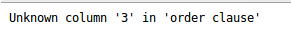
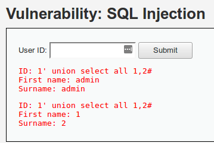
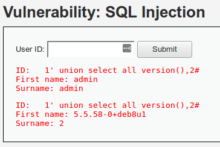
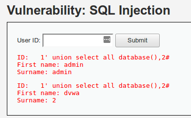
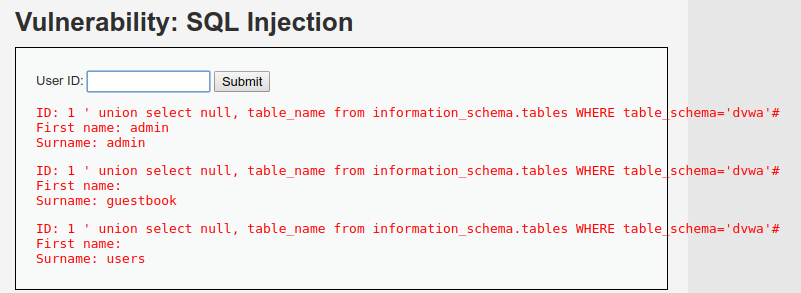
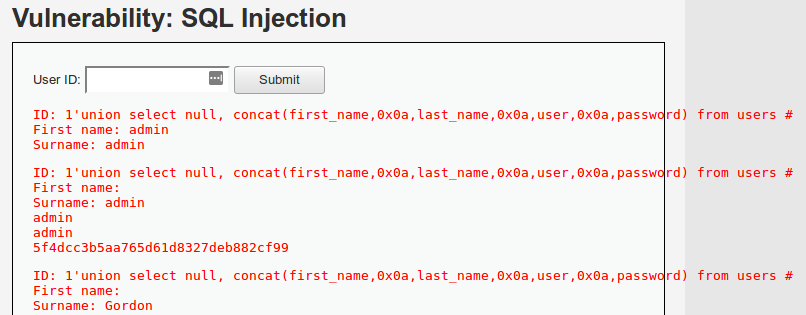
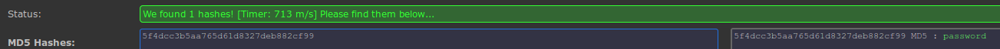

# SQLi Union

### Bajo <a href="#sqlibasiclow" id="sqlibasiclow"></a>

La primera prueba que podemos realizar para ver si una página es vulnerable a SQLi es realizar el ataque de "Codo comillas" o "Croqueta -1", es decir, si tenemos la siguiente URL:

[`http://localhost/vulnerabilities/sqli/?id=1&Submit=Submit#`](http://localhost/vulnerabilities/sqli/?id=1\&Submit=Submit)

Si observamos dicha URL, vemos que tiene el parámetro id y si introducimos una comilla, nos queda de la siguiente forma:

```
http://localhost/vulnerabilities/sqli/?id=1'&Submit=Submit#
```

produciendo un error que nos da una pista de que ese parámetro puede ser vulnerable.

.png>)

Esto se debe a que la sentencia SQL que tenía que tener la siguiente forma:

```sql
SELECT first_name, last_name FROM users WHERE user_id = '$id'
```

nos queda así, haciendo una mala formación de la sentencia y dando error en su ejecución:

```sql
SELECT first_name, last_name FROM users WHERE user_id = '$id''
```

Ahora que sabemos que la consulta puede ser vulnerable a SQLi, vamos a comenzar a obtener información de ella.

Lo primero que vamos a probar es a recuperar todos los datos que nos pueda devolver la sentencia, por lo que vamos a introducir la siguiente inyección:

```sql
1' or 0=0#
```

Como observamos, lo que estamos haciendo es pasar a la variable $id del código SQL un 1 con su cierre de comillas para que nos devuelva el resultado con dicho id o que nos devuelva cualquier valor que haga que 0 es igual a 0, haciendo que nos devuelva toda la tabla. Finalizamos con una almohadilla para comentar el resto de la sentencia SQL que se concatena al final y de esta manera no darnos el error de que hay comillas de más.

A continuación, lo que nos interesa saber es la cantidad de campos que devuelve la sentencia SQL, por lo que vamos a ir ordenando los campos hasta que nos dé error en la ordenación y entonces sabremos cuántos campos tenemos.

```sql
1' order by 1#
```

.png>)

Podemos observar que la columna 3 nos da error, por lo que sabemos que la sentencia SQL tiene 2 columnas.



Conociendo las columnas de las que disponemos, vamos a comprobar dónde se imprime cada columna para sacar la información.

```sql
1' union select all 1,2#
```



Ahora sabemos que el campo 1 se imprime en el nombre y el dos en el apellido.

Ya que tenemos los diferentes sitios de impresión de los campos, vamos a sacar información interesante. Para empezar, iremos con la versión de MySQL, la cual nos dará información para comprobar si existe alguna vulnerabilidad o exploit conocidos.

```sql
1' union select all version(),2#
```



Luego no estaría mal obtener qué usuario tiene en la base de datos, porque si nos encontramos con la suerte de que es root, nos permitirá acceder a toda la información de las diferentes bases de datos.

```sql
1' union select all user(),2#
```

.png>)

Y por supuesto, necesitamos saber cuál es el nombre de nuestra base de datos para poder realizar las siguientes consultas y sacar la información jugosa.

```sql
1' union select all database(),2#
```



Para poder continuar con nuestro ataque, necesitamos saber las tablas que tiene nuestra base de datos y las columnas de dichas tablas. Esta información se almacena en la tabla _information\_schema_ desde la versión 5.0.2 de MySQL.

Así que comenzamos obteniendo todas las tablas que tiene el servidor de MySQL:

```sql
1' union select null, table_name from information_schema.tables#
```

.png>)

Pero tenemos un problema, que aquí nos muestra no solo las tablas de nuestra base de datos sino de todas a las que tenemos acceso, por lo que vamos a acotar un poco más la sentencia para no volvernos locos buscando entre todas las tablas:

```sql
1' union select null, table_name from information_schema.tables WHERE table_schema='dvwa'#
```



Ahora que tenemos las tablas, vamos a buscar la información de la tabla que más nos interesa a todos, que al final es la de usuarios, para ver si podemos acceder a sus contraseñas.

```sql
1' union select null, column_name from information_schema.columns WHERE table_name='users'#
```

.png>)

Ahora que ya tenemos toda la información necesaria, solo nos queda recolectarla:

```sql
1' union select null, concat(first_name,0x0a,last_name,0x0a,user,0x0a,password) from users#
```



Ahora que tenemos los usuarios y los hash, solo nos queda identificar el hash correspondiente y realizar su crackeo. Como observamos que es un MD5, podemos usar la web de HashKiller y obtenemos su contraseña original, que en el caso de admin es "password".



### Medio

En el nivel medio nos encontramos con un select en vez de un input. Podríamos editar el código con el inspector de elementos del navegador y modificar el value del select y realizar la petición, pero es bastante engorroso. Por lo que, en este caso, nos ayudaremos de Burp. No hay que olvidarse de configurar el proxy y empezar a trabajar con él.

Realizamos la primera petición y nos encontramos en Burp lo siguiente. Abajo del todo de la petición, vemos los parámetros que se están enviando por POST, en este caso, que son id y Submit. Como en el ejercicio anterior, nos interesa el id.

.png>)

Lo primero que tenemos que probar de nuevo es el ataque de "Codo comilla", quedando la petición de la siguiente manera.

.png>)

Pero en este caso, el error que obtenemos es diferente y, como vemos, tenemos una barra de escape (\\) delante de nuestra comilla. Esto es debido a que el código está usando la función [mysqli\_real\_escape\_string()](https://www.php.net/manual/es/mysqli.real-escape-string.php), que "escapa los caracteres especiales de una cadena para usarla en una sentencia SQL, tomando en cuenta el conjunto de caracteres actual de la conexión".

.png>)

Por lo que al usar comillas en el ataque no nos funcionará, así que vamos a probar a realizar el primer ataque de SQLi pero sin las comillas a ver qué sucede.

.png>)

.png>)

Como observamos, el ataque funciona. Ahora solo tendríamos que ir repitiendo los ataques que hemos visto en el anterior nivel, pero sin las comillas para evitar la función [mysqli\_real\_escape\_string](http://php.net/manual/es/mysqli.real-escape-string.php)

Ahora que ya sabemos cómo hacer nuestros primeros ataques de SQLi, vamos a proceder a conocer una gran herramienta para estos casos, que es [SQLMap](https://sqlmap.org/).

Volvemos a realizar la petición sin ninguna modificación y la paramos con Burp. En vez de editar la petición, vamos a guardarla. Para ello, hacemos clic secundario -> Save Item.

.png>)

Guardamos el archivo en la ruta que queramos para utilizarlo a continuación con SQLMap. Para utilizar el archivo guardado anteriormente, el cual nos almacena toda la petición, por lo que nos ahorramos tener que especificar todos los parámetros a mano. Lanzamos el siguiente comando:

```bash
python sqlmap.py -r /home/goldrak/pentest/mediumsql
```

Y siguiendo las diferentes opciones que nos dice SQLMap, acabamos obteniendo 3 tipos de inyecciones diferentes.

.png>)

### Alto

Como podemos ver en el último nivel, el input se nos abre en una nueva página y el resultado en otra. En este caso, cuando realizamos el ataque de "Codo comilla", nos genera un error que no nos dice qué caso es, como en el nivel bajo o medio. Por lo que tendríamos que empezar a probar las combinaciones anteriores y, si no, ampliar con el resto de las técnicas que nos enseñan en [OWASP](https://www.owasp.org/index.php/Testing\_for\_SQL\_Injection\_\(OTG-INPVAL-005\)).

.png>)

.png>)

Este caso es igual que el primero, por lo que no vamos a repetir todos los comandos. En su lugar, vamos a ver cómo realizar el ataque en un punto y recuperar la información con SQLMap.

.png>)

Lo primero que vamos a hacer es proceder, como en el nivel medio, a capturar la información con Burp y guardarla en un archivo. Una vez que lo tenemos, solo tenemos que volver a lanzar SQLMap como en el ejemplo anterior, pero agregando el parametro `--second-url` donde definimos donde tiene que buscar la información de retorno.

```
python sqlmap.py -r /home/goldrak/pentest/highsql --second-url="http://localhost/vulnerabilities/sqli/"
```

.png>)

En resumen, para identificar y explotar vulnerabilidades de inyección SQL en diferentes niveles de seguridad, debes familiarizarte con las técnicas básicas de inyección SQL y las herramientas como Burp Suite y SQLMap. Estas herramientas y técnicas te permitirán realizar ataques más sofisticados y adaptarte a diferentes escenarios de seguridad. Recuerda siempre utilizar estas habilidades de manera responsable y ética y solo en entornos controlados o con permiso explícito del propietario del sistema.
