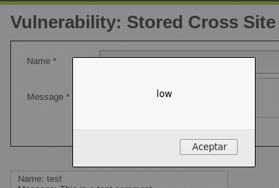
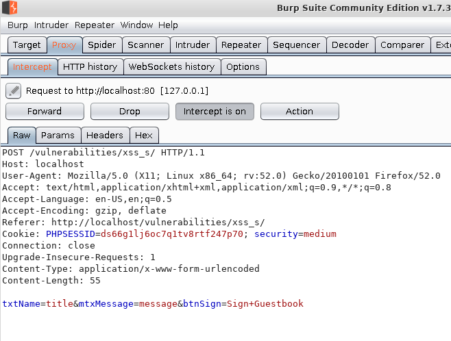
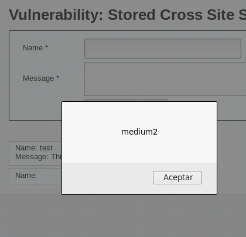

# Almacenado

### Bajo <a href="#storedlow" id="storedlow"></a>

Si entramos en la prueba de XSS persistente (stored), nos encontramos con un libro de visitas con el que jugar, el cual tiene el siguiente código

```php
<?php
if( isset( $_POST[ 'btnSign' ] ) ) {
    // Get input
    $message = trim( $_POST[ 'mtxMessage' ] );
    $name    = trim( $_POST[ 'txtName' ] );
    // Sanitize message input
    $message = stripslashes( $message );
    $message = ((isset($GLOBALS["___mysqli_ston"]) && is_object($GLOBALS["___mysqli_ston"])) ? mysqli_real_escape_string($GLOBALS["___mysqli_ston"],  $message ) : ((trigger_error("[MySQLConverterToo] Fix the mysql_escape_string() call! This code does not work.", E_USER_ERROR)) ? "" : ""));
    // Sanitize name input
    $name = ((isset($GLOBALS["___mysqli_ston"]) && is_object($GLOBALS["___mysqli_ston"])) ? mysqli_real_escape_string($GLOBALS["___mysqli_ston"],  $name ) : ((trigger_error("[MySQLConverterToo] Fix the mysql_escape_string() call! This code does not work.", E_USER_ERROR)) ? "" : ""));
    // Update database
    $query  = "INSERT INTO guestbook ( comment, name ) VALUES ( '$message', '$name' );";
    $result = mysqli_query($GLOBALS["___mysqli_ston"],  $query ) or die( '<pre>' . ((is_object($GLOBALS["___mysqli_ston"])) ? mysqli_error($GLOBALS["___mysqli_ston"]) : (($___mysqli_res = mysqli_connect_error()) ? $___mysqli_res : false)) . '</pre>' );
    //mysql_close();
}
?>
```

Si nos fijamos en el código, las lineas que nos interesan son donde se sanitiza la entrada y como vemos en un campo disponemos de [stripslashes](http://php.net/manual/es/function.stripslashes.php) que quita las barras de un string con comillas escapadas, por lo tanto no nos afecta en nada a la inyección de código.

Por esta razón, volvemos a empezar por las mismas pruebas que en el reflejado

```javascript
<script>alert("low")</script>
```

Obteniendo el siguiente resultado



### Medio <a href="#storedmedium" id="storedmedium"></a>

Como siempre, empezamos por lo mas bajo y vamos subiendo la complejidad del ataque al introducir el código

```javascript
<script>alert("low")</script>
```

nos encontramos con que no funciona quitándonos la etiqueta script y escapando las comillas

.png>)

Y nos encontramos con otro problema que el campo del nombre esta limitado, por lo que nos cabe el código para ejecutar

.png>)

Pero esto tiene un par de soluciones. Nos ponemos a buscar por el código de la web con nuestro inspector de código y vemos que el campo esta limitado a 10 caracteres

.png>)

Lo único que tenemos que hacer es cambiar el _maxlength_ por el tamaño que queramos, en nuestro caso ponemos 100 para que quepa sin problemas. Hay que tener en cuenta que también nos lo pueden limitar en la base de datos, así que vamos a ampliar el _input_ y añadir lo que queramos.

.png>)

.png>)

Pero volvemos a fallar en nuestro intento

.png>)

Si miramos el código observamos, que el mensaje esta totalmente sanitizado, pero en el titulo usa la misma protección que en el ejercicio anterior, por lo que podemos usar la misma técnica de antes

```php
<?php
if( isset( $_POST[ 'btnSign' ] ) ) {
    // Get input
    $message = trim( $_POST[ 'mtxMessage' ] );
    $name    = trim( $_POST[ 'txtName' ] );
    // Sanitize message input
    $message = strip_tags( addslashes( $message ) );
    $message = ((isset($GLOBALS["___mysqli_ston"]) && is_object($GLOBALS["___mysqli_ston"])) ? mysqli_real_escape_string($GLOBALS["___mysqli_ston"],  $message ) : ((trigger_error("[MySQLConverterToo] Fix the mysql_escape_string() call! This code does not work.", E_USER_ERROR)) ? "" : ""));
    $message = htmlspecialchars( $message );
    // Sanitize name input
    $name = str_replace( '<script>', '', $name );
    $name = ((isset($GLOBALS["___mysqli_ston"]) && is_object($GLOBALS["___mysqli_ston"])) ? mysqli_real_escape_string($GLOBALS["___mysqli_ston"],  $name ) : ((trigger_error("[MySQLConverterToo] Fix the mysql_escape_string() call! This code does not work.", E_USER_ERROR)) ? "" : ""));
    // Update database
    $query  = "INSERT INTO guestbook ( comment, name ) VALUES ( '$message', '$name' );";
    $result = mysqli_query($GLOBALS["___mysqli_ston"],  $query ) or die( '<pre>' . ((is_object($GLOBALS["___mysqli_ston"])) ? mysqli_error($GLOBALS["___mysqli_ston"]) : (($___mysqli_res = mysqli_connect_error()) ? $___mysqli_res : false)) . '</pre>' );
    //mysql_close();
}
?>
```

```javascript
<SCRIPT>alert("medium")</SCRIPT>
```

Y ya tenemos nuestro premio

.png>)

En este caso podemos resolverlo así pero si, en lugar de estar limitado por un _maxlength_ nos encontramos que hay un JS que es el que se encarga de ello y encima esta ofuscado nos podemos volver un poco locos buscando donde se encuentra el punto de validación para hacer bypass, por lo que vamos a resolver el mismo problema pero aprovechando un Proxy en nuestro caso [Burp Suite](https://portswigger.net/burp) para capturar la petición y modificarla antes de que llegue al servidor.

Para ello lo primero que tenemos que hacer es configurar nuestro navegador para que utilice el proxy con servidor 127.0.0.1 y puerto 8080 una vez que lo tenemos, arrancamos Burp y vamos a la pestaña proxy, donde tenemos el Intercept que parará todas las peticiones que realice el navegador a partir de ahora. Si queremos dejar de capturar peticiones, solo tenemos que hacer click en Intercept is on y se pondrá en off y viceversa.

Para ir dejando pasar los paquetes que no queramos tocar, le damos a Forward o Drop según lo que queramos hacer.



Hemos introducido en los diferentes inputs los textos title y message, dichos texto los podemos aquí modificar según lo necesitemos. Una vez modificado, hacemos click en Forward y se enviara al servidor, obteniendo nuestro querido XSS.&#x20;

Nos quedara de la siguiente manera la petición:

.png>)



### Alto

Vamos con el ultimo punto de nuestros XSS. De nuevo, empezamos desde los ataques mas sencillos a los mas complejos repetimos el ataque de nivel medio con el burp

.png>)

Y herramos el tiro. Como observamos la salida es diferente en el caso del nombre y del mensaje, por lo que, si nos fijamos en el código, en uno esta sanitizando correctamente y en el otro caso nos encontramos con el mismo código que en alto de reflejado. De tal manera que podemos repetir cualquiera de los dos ataques anteriores

.png>)

```php
<?php
if( isset( $_POST[ 'btnSign' ] ) ) {
    // Get input
    $message = trim( $_POST[ 'mtxMessage' ] );
    $name    = trim( $_POST[ 'txtName' ] );
    // Sanitize message input
    $message = strip_tags( addslashes( $message ) );
    $message = ((isset($GLOBALS["___mysqli_ston"]) && is_object($GLOBALS["___mysqli_ston"])) ? mysqli_real_escape_string($GLOBALS["___mysqli_ston"],  $message ) : ((trigger_error("[MySQLConverterToo] Fix the mysql_escape_string() call! This code does not work.", E_USER_ERROR)) ? "" : ""));
    $message = htmlspecialchars( $message );
    // Sanitize name input
    $name = preg_replace( '/<(.*)s(.*)c(.*)r(.*)i(.*)p(.*)t/i', '', $name );
    $name = ((isset($GLOBALS["___mysqli_ston"]) && is_object($GLOBALS["___mysqli_ston"])) ? mysqli_real_escape_string($GLOBALS["___mysqli_ston"],  $name ) : ((trigger_error("[MySQLConverterToo] Fix the mysql_escape_string() call! This code does not work.", E_USER_ERROR)) ? "" : ""));
    // Update database
    $query  = "INSERT INTO guestbook ( comment, name ) VALUES ( '$message', '$name' );";
    $result = mysqli_query($GLOBALS["___mysqli_ston"],  $query ) or die( '<pre>' . ((is_object($GLOBALS["___mysqli_ston"])) ? mysqli_error($GLOBALS["___mysqli_ston"]) : (($___mysqli_res = mysqli_connect_error()) ? $___mysqli_res : false)) . '</pre>' );
    //mysql_close();
}
?>
```

En este caso lo vamos ha hacer con img. Estamos poniéndolo en los dos porque nosotros realmente no sabemos el código que se esta ejecutando por detrás

.png>)

Y ya tenemos nuestro XSS conseguido

.png>)

## &#x20;<a href="#dom" id="dom"></a>
