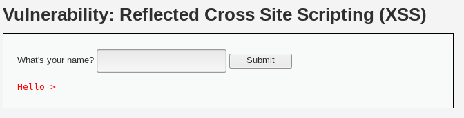

# Reflejado

### Bajo <a href="#reflectedlow" id="reflectedlow"></a>

Comenzamos en el primer nivel y al entrar nos encontramos con un _input_ que nos pide el nombre, si lo introducimos vemos que nos lo imprime directamente lo introducido en el _input_, dado que el código que se ejecuta recoge la variable y la imprime directamente.

```php
<?php 

// Is there any input? 
if( array_key_exists( "name", $_GET ) && $_GET[ 'name' ] != NULL ) { 
    // Feedback for end user 
    echo '<pre>Hello ' . $_GET[ 'name' ] . '</pre>'; 
} 

?>
```

.png>)

Viendo este comportamiento lo primero que hacemos es probar el primer ataque más básico de XSS que es:

```javascript
<script>alert(1)</script>
```

con lo que obtenemos el resultado de la siguiente imagen

.png>)

Si observamos la barra de direcciones se encuentra el código insertado en el _input_ por lo que si mandamos el enlace a cualquier persona, se le ejecutara el código XSS que hemos introducido.

.png>)

### Medio <a href="#reflectedmedium" id="reflectedmedium"></a>

Vamos con el nivel medio. Si volvemos a probar el mismo código de antes

```javascript
<script>alert(1)</script>
```

Vemos que no funciona quitando los tags script y, por lo tanto, sin ejecutar el código JavaScript para el XSS

.png>)

esto se debe a que la programación que tiene ahora el _input_ es la siguiente

```php
<?php

// Is there any input?
if( array_key_exists( "name", $_GET ) && $_GET[ 'name' ] != NULL ) {
    // Get input
    $name = str_replace( '<script>', '', $_GET[ 'name' ] );

    // Feedback for end user
    echo "<pre>Hello ${name}</pre>";
}

?>
```

Esto hace que, en la linea del str\_replace(), se nos elimine código \<script> y lo cambie por un string en blanco, si vamos a la [documentación](http://php.net/manual/es/function.str-replace.php), observamos que existe la función [str\_ireplace()](http://php.net/manual/es/function.str-ireplace.php), la cual es insensible a mayúsculas y minúsculas, pero la que se esta utilizando no, por lo tanto vamos a cambiar \<script> por \<SCRIPT> y vamos a ver que sucede.

```javascript
<SCRIPT>alert("medium")</SCRIPT>
```

Si ejecutamos este nuevo código nos encontramos que ahora si funciona el ataque de XSS

.png>)

.png>)

### Alto <a href="#reflectedhigh" id="reflectedhigh"></a>

Ya estamos en el ultimo nivel de los reflejados, por lo que, como hicimos en medio, vamos a probar que sucede si introducimos los códigos de antes

```javascript
<script>alert(1)</script>
<SCRIPT>alert("medium")</SCRIPT>
```



De nuevo, no funciona el ataque XSS. Si analizamos el código ahora, vemos que que se ha utilizado una expresión regular y, por lo tanto, ya no podemos usar los tags de script

```php
<?php

// Is there any input?
if( array_key_exists( "name", $_GET ) && $_GET[ 'name' ] != NULL ) {
    // Get input
    $name = preg_replace( '/<(.*)s(.*)c(.*)r(.*)i(.*)p(.*)t/i', '', $_GET[ 'name' ] );

    // Feedback for end user
    echo "<pre>Hello ${name}</pre>";
}

?>
```

Por lo tanto vamos a usar otras técnicas como, por ejemplo, aprovechar los eventos de HTML, los ejemplos que realizaremos serán con img y svg, pero hay muchos mas que podéis consultar en el siguiente [enlace](https://www.owasp.org/index.php/XSS\_Filter\_Evasion\_Cheat\_Sheet).

Para img vamos a usar la propiedad _onerror_ que nos ejecutara el código que le digamos cuando falla la carga de la imagen, por lo tanto, sólo tenemos que poner una imagen no valida y el código JavaScript que queramos en _onerror_

```markup

```

Como podemos observar, a continuación, se ejecutara el _alert_ debido a que _x_ no es una imagen validad y fallara al cargarla.

.png>)

.png>)

El siguiente ejemplo para superar este nivel es con SVG, el cual ejecuta código una vez cargado el svg

```
<svg/onload=alert('High2')>
```

.png>)

.png>)

## &#x20;<a href="#storedhigh" id="storedhigh"></a>

